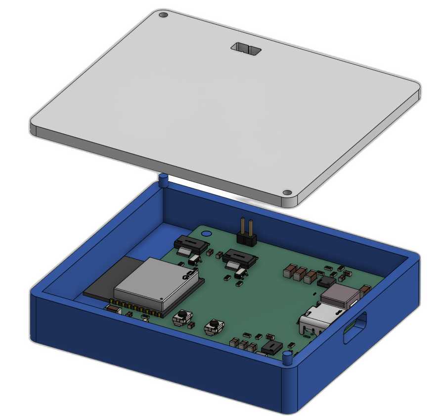
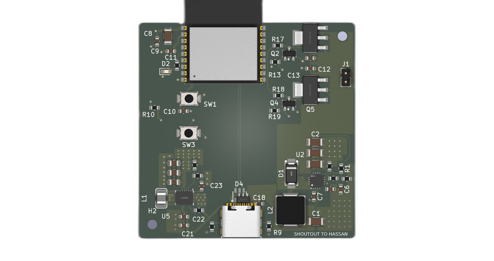
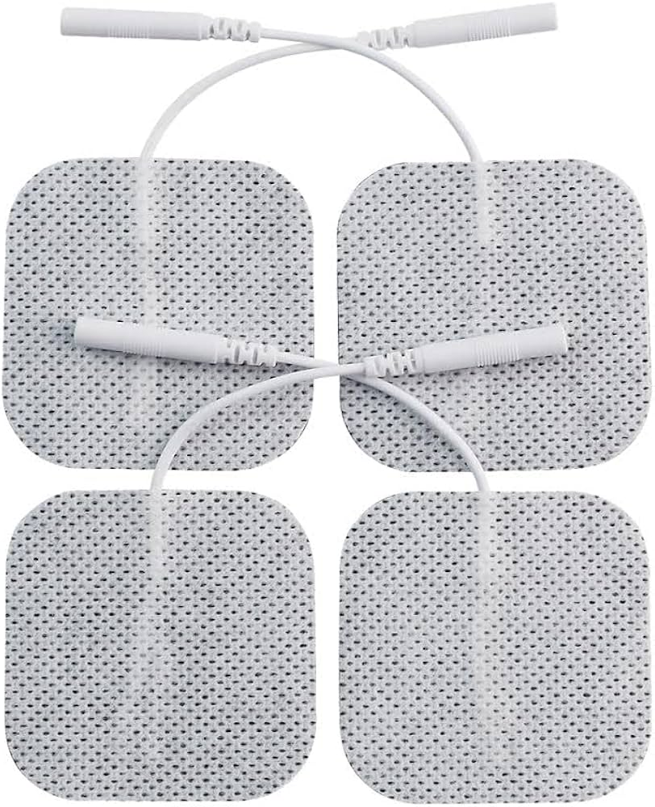
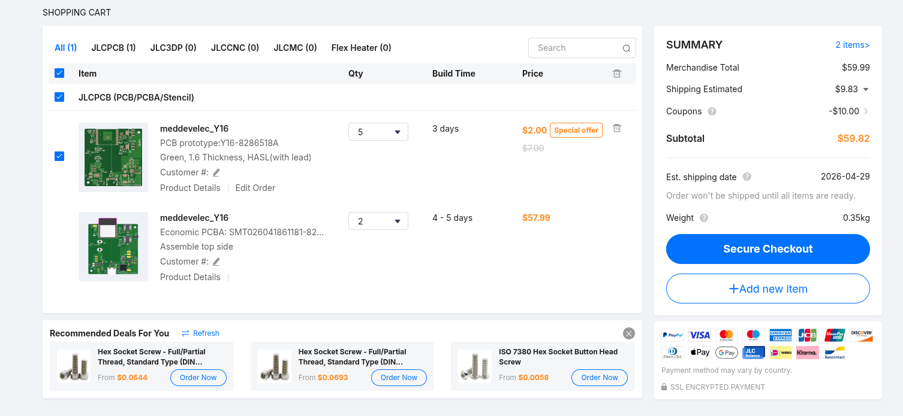
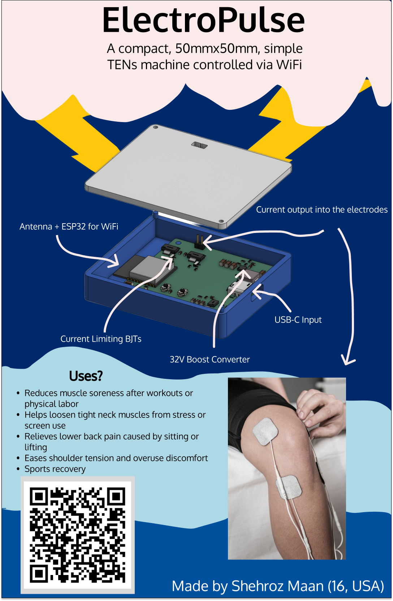

# Electropulse

A custom, homemade, low voltage, simple TENs device

## Features
* ESP32-C3 Microntroller with Bluetooth
* Wireless control
* WiFi controlled
* USB-C powered
* Low-cost - total BOM + board ~$11.56 per board
* Two output channels
* Modular + fits with different electrode types
* Two buck boosts for efficiency
* BJT controlled current limiter

## Use
* Flash the code onto the ESP32 using Arduino IDE
* Go to http://<esp32-ip>/
* Connect your electrodes to the pin headers

## Motivation
I made this project because I've been struggling a little bit with knee pain and I found that other options on the market weren't as adjustable. I also had electrodes lying around (due to a separate business pitch project) and I wanted to make use of them

## BOM
To use this device, electrodes are a requirement. To purchase these, you can go to Amazon at [this link](https://www.amazon.com/Best-Sellers-Electrodes/zgbs/industrial/3013606011)

For the rest of the BOM, see the BOM file attached. 

## JLCBPCB Order
For two assembled PCBs, the cost is around ~70$ for the cheapest shipping option. Keep in mind that there are a lot of alternatives to the parts selected, so ifsomething is unavailable you can easily change them around within the JLCPCB assembly order.

## Firmware

The code is written using Arduino IDE compiled for an ESP32-C3. Please note that the local host where the web page is hosted depends entirely on your ESP32, so it may not be the same for everyone. Also be sure to input your wifi credentials when flashing so that the ESP32 can connect to WiFi. 

## Fallout Zine Poster

## Thanks

Huge thanks to HackClub for helping me with this project!

## Verfication
Hack Club Username: shehrozmaan4
